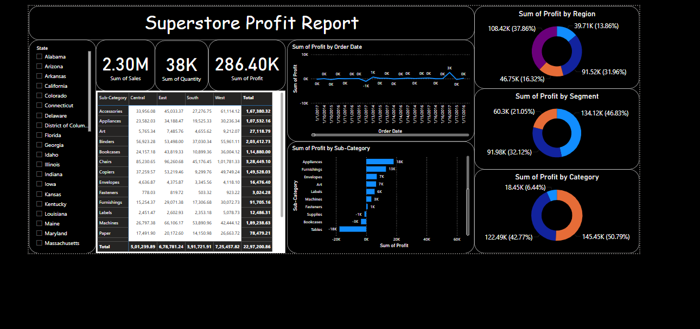

# 📊 Superstore Profit Dashboard - Power BI

Welcome to the **Superstore Profit Dashboard**, an interactive Power BI report designed to explore sales and profit trends from a fictional superstore dataset. 🚀

---

## 🔍 Insights & Features:

- 💰 **Total Sales, Profit, and Quantity KPIs** at a glance  
- 🌍 **Region-wise** and 🧍 **Segment-wise** performance comparison  
- 🗂️ Breakdown by **Category** and **Sub-Category**  
- 📈 Profit trends over time using line charts  
- 🧽 Slicers to filter by Region, Segment, or Category  

---

## 🛠️ Tools & Technologies:
- Microsoft Power BI  
- DAX for calculated measures  
- Interactive visuals and slicers  
- Clean layout for business storytelling  

---

## 📸 Dashboard Preview:

---

## 📁 File Info:
- `Superstore_Profit_Dashboard.pbix` → Main Power BI file  
- `screenshot.png` → Visual preview  

---

> 🎯 This dashboard is ideal for practicing business intelligence skills and gaining insights from retail datasets. Feedback is welcome!

