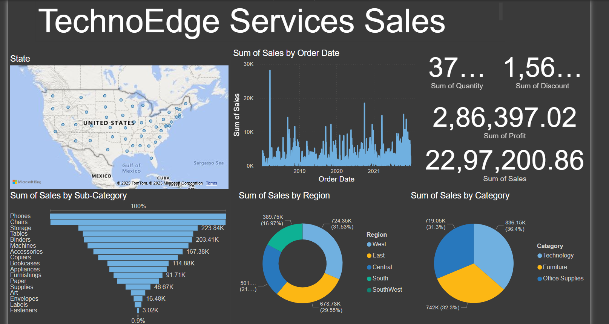

# 🧠 TechnoEdge Sales Dashboard - Power BI

Explore the **TechnoEdge Sales Dashboard**, a business intelligence report built in Power BI to analyze company-wide sales performance and customer behavior. 📈

---

## 🔍 Dashboard Highlights:

- 📊 **Total Revenue, Orders, and Profit KPIs**  
- 🗺️ **State-wise and Regional breakdown** via map visuals  
- 🧑‍💼 Sales by **Customer Segment** and **Product Categories**  
- 📆 **Monthly trend analysis** to track sales over time  
- 🎯 Slicers for dynamic filtering by State, Category, and more  

---

## 🛠️ Tools & Technologies:
- Power BI Desktop  
- DAX for custom measures  
- Heatmaps, maps, and bar charts  
- Responsive and business-ready layout  

---

## 📸 Dashboard Preview:

---

## 📁 File Info:
- `TechnoEdge_Sales_Dashboard.pbix` → Power BI report  
- `screenshot.png` → Dashboard preview  

---

> 💡 Built to demonstrate data storytelling, trend identification, and executive-level reporting using Power BI. Open to suggestions and improvements!

